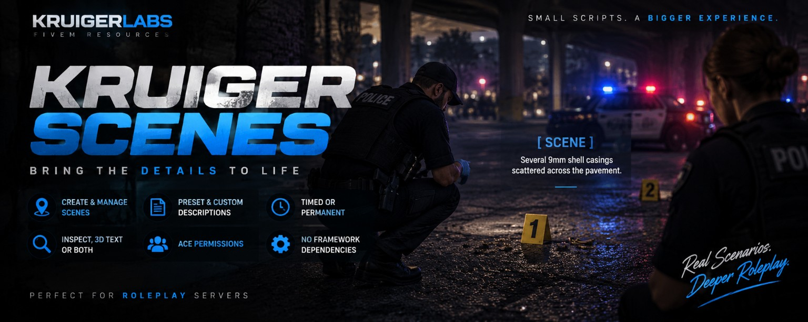

# KruigerScenes — Free FiveM Scene & Evidence Script

KruigerScenes is a **standalone synchronized FiveM scene script** for roleplay scenes and evidence descriptions. Players can place scene text directly in the world with presets for blood, shell casings, broken glass, debris, burn marks, footprints, evidence, and custom descriptions.

## Features
- `/scene` creation menu
- `/scenes` scene manager
- Raycast placement directly into the world
- Evidence and roleplay presets
- Inspect-only, 3D-text, or combined display modes
- Timed and permanent scenes
- Permanent scene persistence through `scenes.json`
- Server-side ACE validation
- Per-player limits and creation cooldown
- Configurable view/interact distance
- No ESX, QBCore, or dependencies

## Installation
1. Place `KruigerScenes` in your FiveM resources folder.
2. Add `ensure KruigerScenes` to `server.cfg`.
3. Add the ACE permissions you want.
4. Restart the resource/server.

## ACE permissions
```cfg
add_ace group.leo kruiger.scenes.create allow
add_ace group.fire kruiger.scenes.create allow
add_ace group.admin kruiger.scenes.permanent allow
add_ace group.admin kruiger.scenes.manage allow
```

## Documentation
- Full documentation: https://kruigerlabs.xyz/docs/free-scripts/kruigerscenes
- FiveM scripts: https://kruigerlabs.xyz/fivem
- Documentation center: https://kruigerlabs.xyz/docs/

## License
MIT License — Copyright (c) 2026 KruigerLabs. See `LICENSE` for the repository's complete license terms.
